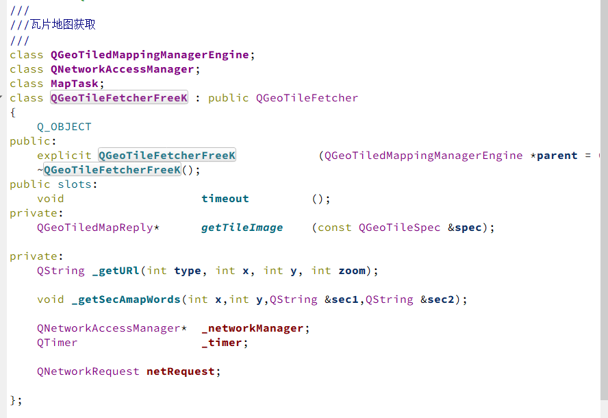

# QT地图插件开发 

`` 通过QtPositioning模块，提供定位机制、地图和导航技术、位置搜索等功能的QML和C++的API。
``
## 操作步骤
#### 1. 实现地图服务插件的创建  

继承QGeoServiceProviderFactory实例化服务工厂
#### 2.实现虚函数接口

这里先实现地图的显示
#### 3.创建瓦片引擎和地图

在瓦片引擎中设置地图属性，缓存等

比较重要的是地图瓦片的获取

这里要实现重写getTileImage获取瓦片image
URL获取需要各家的瓦片地图获取API

#### 4.创建瓦片回复类

